# 체스토리 판단 경계와 플레이어용 구조화 commentary

## 1. 완성 상태

체스토리 백엔드의 책임은 구조화 commentary의 근거를 만드는 것이다. 합법 수순, 엔진 비교, 보드 관계, 구조 변화, 계획의 인과관계를 하나의 닫힌 증거 그래프로 만들고, 그 그래프가 지지하는 판단만 공개한다.

완성된 런타임은 다음 조건을 동시에 만족한다.

1. 같은 사실이나 판단을 소유하는 타입이 둘 이상 존재하지 않는다.
2. 모든 공개 판단은 등록된 증거와 연결된다.
3. 평가값의 관점, 수순의 합법성, 비교 대상이 중간 단계에서 바뀌지 않는다.
4. 인간적 아이디어의 탐색과 사실의 인증을 분리한다.
5. 전체 player-use system 목표 표기 `Q → F → C → Jp → Ja → R → P`에서 player `Q`는 `CommentaryJobReducer`가 소유한다. 서버는 canonical history와 played focus를 검증하고, 하나의 root candidate bundle, 필요할 때만 played-vs-best comparison, 의미 계층이 요구한 추가 causal work를 순차 발급·입회한다.
6. 브라우저는 preflight 뒤 전용 exact profile worker `sf18-smallnet-t2-h16-v1`만 사용하며 ordinary selectable ceval은 절대 사용하지 않는다. 서버가 발급한 `search_fen`·depth·MultiPV만 실행하고 suffix를 돌려주는 thin opaque executor로서, legal move를 열거하거나 work·probe·coverage를 선택하거나, root line·평가·Cause를 구성하거나, admission을 결정하지 않는다.
7. 서버는 suffix admission 전에 required profile을 parse·bind하고 terminal projection까지 보존한다. issued work·report·status·response의 profile equality가 없거나 unsupported이면 semantic use 전에 거부한다. 브라우저 preflight failure는 POST도 server job도 만들지 않는 local unavailable fault다. 일치하는 issued work가 outstanding인 동안의 execution failure만 profile-bound `executor_failed`로 보고되고 서버는 stop하며 downgrade·retry·fallback이 없다. 이 profile equality는 configured contract binding만 증명하며 hostile-client 또는 remote attestation은 증명하지 않는다.
8. 서버는 admission 뒤의 `F → C → Jp → Ja → R → P`와 packet/projection을 계속 소유한다. `RawMoveReviewInput` 직접 경로는 development-only 직접 입력이며 player-use transport 또는 Q 권위가 아니다.
9. evaluation/oracle material은 development-only이며 player-use runtime 계약과 분리한다.

## 2. 단일 권위 흐름

```mermaid
flowchart LR
    A["요청: canonical history + played focus"] --> Q["Q: focused v6 work ledger"]
    Q --> X["thin opaque browser executor: suffix only"]
    X --> N["server EngineLineAdmission: replay + bind"]
    N --> B["정규화된 입력"]
    B --> C["Position / Line / Transition"]
    C --> D["TypedEvidenceGraph"]
    D --> E["JudgmentClaim 후보"]
    E --> F["ClaimTruthPolicy 진실 승인"]
    F --> K["ClaimDeduplicator 의미 중복 제거"]
    K --> L["ClaimArbitrator Cause 공개 결정·canonical claim host 운반"]
    L --> M["DirectCauseImportancePolicy typed 부분순서 + OrderingPolicy selectionOrder"]
    M --> G["닫힌 EvidenceBackedJudgmentPacket"]
    G --> H["직접 공개 JSON 투영"]
    H --> I["플레이어용 구조화 commentary"]
    D --> J["server-owned 추가 probe work"]
    J --> X
```

각 단계의 권위는 하나뿐이다.

| 의미 | 단일 권위 |
|---|---|
| Stockfish 후보선 | `EngineLine` |
| player Q의 root/focus/causal work와 중복 없는 admission | `CommentaryJobReducer`와 `PreparedFocusedMoveReview` |
| browser suffix의 replay·root binding·mate 기준 정규화 | `EngineLineAdmission` |
| 합법 수순 재생 | `PrincipalVariationEvidence.legalMoveReplay` |
| 조립 중 상태 | `JudgmentAssemblyContext` |
| 사실과 출처 관계 | `TypedEvidenceGraph` |
| played/reference 수치 비교와 verdict | `CandidateComparisonEvidence(CandidateComparisonFact)` |
| 후보군 구성과 best/second 분류 | `CandidateSetDescriptor` |
| 공개 가능한 체스 판단 | `JudgmentClaim` |
| claim 진실 승인 | `ClaimTruthPolicy` |
| 승인 claim의 의미 중복 제거 | `ClaimDeduplicator` |
| Cause의 비교 공개 선택과 tier/claim-ID canonical host 운반 | `ClaimArbitrator`가 호출하는 `PlayerFacingCauseExposurePipeline` |
| 모든 C Cause의 Jp→Ja→R 최종 상태 원장 | `CauseDispositionPolicy` |
| 이미 선택된 Cause effect의 typed domain 내 중요도 해석 | `DirectCauseImportancePolicy` |
| 중요도 부분순서를 선택 집합 불변의 공개 순서로 반영 | `PlayerFacingIdeaOrderingPolicy` |
| 런타임 전달물 | `EvidenceBackedJudgmentPacket` |
| 플레이어용 commentary 형식 | 저장되지 않는 직접 JSON 투영 |

공개 형식은 별도 의미 모델이 아니다. 그래프와 claim을 읽는 일회성 표현이다. 따라서 표현 형식이 바뀌어도 체스 사실과 판단 권위는 늘어나지 않는다.

여기서 선택 권위와 중요도 해석 권위는 역할이 다르다. `PlayerFacingCauseExposurePipeline`만 공개 Cause 집합과 비교 관점을 선택하고, `DirectCauseImportancePolicy`는 그 집합을 변경하지 않은 채 이미 인증된 typed effect 사이의 부분순서만 해석한다. `PlayerFacingIdeaOrderingPolicy`는 그 결과의 dominance layer를 commentary-ready idea unit과 그 Cause facet의 `selectionOrder`에 반영할 수 있지만 Cause를 추가·삭제·변형할 수 없다. 따라서 importance 계층은 두 번째 선택 arbitrator가 아니다.

## 3. 구성 시점 불변식

패킷은 공개 생성자를 갖지 않는다. 생성 시 다음 조건을 모두 확인한 조립 상태만 패킷이 된다.

- 루트 position, 후보 line, evidence record가 존재한다.
- evidence ID는 중복되지 않는다.
- 모든 evidence parent가 같은 그래프에 등록되어 있다.
- evidence가 가리키는 position과 line이 조립 상태에 존재한다.
- 모든 claim의 근거가 그래프에 등록되어 있다.
- 모든 상대평가의 비교·원인·판정 근거가 그래프에 등록되어 있다.
- C에 등록된 모든 `RelativeCause` evidence ID는 `CauseDispositionLedger`에 정확히 한 번 존재한다. 원장은 새 판정을 만들지 않고 `ClaimTruthPolicy`의 Ja 결정, `ClaimDeduplicator` trace, canonical `PlayerFacingCauseExposureResolution`만 소비하여 `selected`, `dominated`, `redundant`, `diagnostic`, `inferior`, `admission-deferred`, `rejected`, `unproposed`, `object-unready` 중 하나로 귀결한다. 준비된 Cause가 claim host 없이 남으면 `unproposed`, 승인 뒤 claim dedup에서 host를 잃으면 해당 trace에 결속된 `redundant`이므로 조용히 사라질 수 없다.
- C의 의미 정규화는 공개 준비가 된 Cause를 동일 `RelativeCauseSemanticFrameKey` 안에서만 다룬다. 그 안에서 root-owned `causal_signature`가 하나라도 겹치는 Cause들을 **연결요소**로 묶어 proof·support를 한 번 병합한다. 따라서 `{A,B}`와 `{B,C}`는 한 Cause가 되지만 서로 겹치지 않는 `{A}`와 `{C}`는 같은 frame이어도 별도 Cause로 보존된다. 병합 뒤에는 기존에 승인된 signature와 다시 계산한 비모호 signature의 교집합만 `DirectEffectAdmission.Restricted`에 남긴다. 같은 signature의 effect descriptor가 충돌하면 임의의 승자를 고르지 않고 그 채널만 fail-closed한다. 이는 exact-equality 대표 선택이나 strict-subset 승자 방식이 아니다. 공개 미준비 Cause는 자기 evidence ID와 함께 서로 분리해 보존한다.
- 공개 fallback 억제는 `RelativeCauseDominancePolicy` 한 곳에서만 판정한다. 독립적으로 공개 가능한 하나의 specific Cause가 같은 root·source·attribution·event line·effect mode에서 generic Cause의 모든 직접 effect를 스스로 소유하고 공개 tier를 낮추지 않을 때만 억제한다. sibling의 채널을 합치거나 이름의 유사성으로 정제 관계를 만들지 않는다. 현재 즉시 정제 관계는 `MissedTacticalResource → {WrongMoveOrder, RecaptureRecoveryWindow, KingForcing, MaterialSwing}`, `CandidateTacticalLiability → MaterialSwing`, `MaterialSwing → SacrificeCompensation`, `TacticalRefutationOfPlayed → {TempoLoss, KingForcing}`뿐이다. 서로 비교 불가능한 Cause는 모두 보존하며, 제거된 fallback은 최종 선택 집합 안에 실제 maximal direct dominator를 가져야 한다.
- ordered line pair마다 비교 레코드는 하나뿐이며, delta·승률 변화·mate·verdict는 두 등록 line에서 정규 생성한 값과 정확히 같다.
- 후보군 descriptor는 실제 best/second pair 한 레코드만 소유하고, 그 분류에 사용한 top-3 line/eval을 parent로 가진다.
- F는 Cause draft와 무관하게 각 비교의 reference/candidate endpoint inventory를 만든다. 합법 재생된 line의 material·mate·qualitative family는 각각 독립적인 completeness를 가지므로 한 family의 누락이 다른 family를 지우지 않는다. material은 완전한 material window와 정확한 값, mate는 engine-backed mate 평가와 root-owned mate 관찰의 일치, qualitative은 정확한 합법 line에서 도출된 전체 관찰을 요구한다. structural은 root move의 합법적인 exact endpoint delta, strategic은 해당 비교의 모든 axis·source·outcome이 완전한 exact contrast를 요구한다. 필요한 source/counterpart inventory가 incomplete·중복 모호·불일치이면 C는 draft나 다른 family의 근거로 채우지 않고 해당 차등 채널을 명시적으로 보류한다.
- 외부 `currentEvalCp`, `deltaVsBaseline`, probe 요약 평가값은 입력 계약에서 제거되었으며, 그래프 평가는 등록된 line에서만 파생된다.
- 합법수 생성은 `PrincipalVariationEvidence.actualLegalMoves` 한 곳만 소유한다. 캐시 키는 보드 문자열이 아니라 시계와 반복 이력을 포함한 완전한 `Position`이므로 같은 보드라도 서로 다른 발생의 `Move.after`를 섞지 않는다. `PositionAnalyzer`는 전달된 `Position`과 FEN의 semantic board state가 일치할 때만 캐시를 조회한다. 동일 semantic board state의 폰 topology·slider ray·rule attack만 공유하고, occurrence별 합법수와 그 합법수에서 나온 `PiecePressure`는 해당 발생에 결속한다.
- 표준 관계의 board-snapshot 생산자는 `PositionRelationExtractor` 하나다. 모든 슬라이더 방향은 보드 끝까지 만나는 **모든 occupied square를 거리순으로** 하나의 `RayBarrier` 사실에 보존한다. 핀·엑스레이·배터리·스큐어는 이 완전한 점유열에서 결정적으로 분류할 뿐 별도 board fact를 생산하지 않는다. 세 번째 이후 점유자는 향후 해소 순서를 위한 정확한 witness이지 현재의 즉시 전술 target이 아니므로 둘을 혼동하지 않는다. 이 사실의 의존 범위도 공격자에서 보드 끝까지여야 하므로 먼 기물이 바뀌어도 기존 장벽 뒤에 숨지 않는다. 다만 먼 점유자만 바뀐 전체 위상 churn은 첫 장벽·즉시 표적·축이 같은 기존 핀·엑스레이·스큐어·배터리를 새로 만들지 않는다. `RelationRayProjection`이 named 관계, 즉시 표적, 배터리 형성의 단일 투영 권한을 가지며 구조 계층이 `occupants.lift(1)`을 다시 해석하지 않는다. named ray를 합법 line에 투영할 때도 새 기하 생산자로 취급하지 않고 정확한 after-position `RayBarrier` 하나를 직접 부모로 가져야 한다. 실제 합법 수 하나의 `BoardTransitionFootprint`는 바뀐 각 칸의 before/after occupant와 그 칸을 지나는 모든 slider origin을 보존한다. 이후 공격맵과 ray/barrier는 이 발자국으로 희소 갱신하며 냉간 계산과 완전 동치여야 한다. 캐슬링의 룩, 앙파상 제거 칸, promotion 역할 변환을 주 이동자 두 칸으로 축소하지 않는다.
- 현재 차례의 `LegalMove`만 occurrence 전역 사실이며 합법 transition마다 정확히 재생산한다. FEN의 active color와 `PositionNodeRef.sideToMove`가 일치하지 않는 발생점은 관계 그래프와 폐쇄 인증에서 모두 거부한다. 부재는 저장되는 음성 fact가 아니라 폐쇄 인벤토리에 대한 타입화된 질의로만 그때그때 증명한다. `AnyLegalMove`와 `LegalCaptureOf`는 실제 side-to-move에만 허용하고, `GeometricFriendlySupportOf`는 해당 칸에 실제 아군 기물이 있을 때의 기하적 지원 부재만 뜻한다. 이들 중 어느 하나도 단독으로 “수비자가 없다”나 “응수가 없다”로 승격되지 않는다.
- 구조 델타가 소비하는 전·후 범위는 전이 종류에서 다시 추측하지 않고 등록된 `PositionNode.role.scope`가 소유한다. 위협 응수선도 FEN에서 별도 시작 분석을 만드는 대신 등록된 위협 결과 분석의 실제 합법수에 다시 결속하며, 동일 수가 여러 위협 발생점에 있으면 각 전이 evidence ID가 별도 구조 델타를 소유한다.
- 관계 인증은 canonical position extractor와 legal tactical replay 두 입구뿐이다. 임의의 detail에 합법 수순을 붙이는 것으로 인증 등급을 올릴 수 없고, 구조 목적 문자열은 닫힌 문법으로 완전히 파싱되어 actor·출발칸·도착칸·대상·promotion까지 정확히 결속된다. 이름만 있고 이 의무를 증명하지 못하는 pattern·plan은 생산하지 않는다.
- 구조 델타는 정확히 일치하는 합법 `MoveTransitionEvidence`와 전·후 `PositionFeatureEvidence`를 직접 부모로 가져야 증명 가능하다. 생산자 이름이나 보드 좌표가 든 문자열만으로는 권한을 얻지 못한다.
- 표준 관계 델타는 전·후 relation node 목록이 각 `PositionAnalysis`의 전체 canonical inventory와 정확히 일치할 때만 인증한다. 증명 키는 실제 changed square와 그 dependency를 통과한 moved piece뿐이다. 같은 file이라는 사실은 검색 인덱스일 수는 있어도 인과 증명이 아니다. 한 합법 전이의 변화들은 pairwise 사실을 재생산하지 않고 하나의 `CanonicalRelationChangeCombination`에서 모두 보존하며, 각 변화는 자기 관계를 실제로 건드린 changed-square·moved-piece 키를 잃지 않는다. 따라서 앙파상처럼 서로 다른 변경 칸이 서로 다른 선을 동시에 여는 경우도 한 전이로 결합되지만, 관계마다 국소 증명 키는 섞이지 않는다. 결합으로 파생된 관계도 선택한 premise들의 증명 키 전부를 보존하고, 그래프 승인 시 각 전·후 premise가 그 실제 칸·기물 변화에 다시 결속되는지 확인한다. 이것은 동시 관계변화를 증명할 뿐, 준비·예방·과부하 같은 이름이나 인과 결론을 자동 승인하지 않는다. 현재 차례에만 성립하는 `LegalMove`도 턴이 바뀌었다는 이유로 move-caused 델타가 될 수 없다. 임의로 차례를 바꾼 가상 합법수나 별도 attack-map에는 증명 권한이 없다.
- 같은 계획 사건에서 증명된 결과와 응답 후속 관계는 진실 단계에서 전부 보존한다. 역사 의존관계도 kind별 최신 하나를 고르지 않고 모든 exact dependency를 보존한다. 같은 target square는 상관관계일 뿐 선행 수가 후속 수를 가능하게 했다는 증명이 아니므로 causal dependency가 아니다. `representativeResult`는 미래 수·목표를 하나만 보여줘야 하는 표시 투영에만 쓰며, branch 승인·Cause 원시값·robust/refuted 결과 권한은 복수 `PlanCausalResultAssessment`를 각각 소비한다. 결과 종류별 salience 점수나 의존관계 종류별 우선순위로 형제를 버리지 않는다.
- 관계와 line consequence가 같은 PV에 있거나 같은 target square를 언급한다는 이유만으로 tactical mechanism을 만들지 않는다. 관계 occurrence와 결과 사이의 명시적 causal edge가 없으면 비워 둔다. Cause attribution도 kind/source fallback으로 만들지 않고 draft 생성 시 `ReferenceCreatesResource`, `CandidateCreatesValue`, `CandidateAllowsLiability`, `SharedContext`를 증명 경로가 명시해야 한다. 누락된 attribution은 public cause 권한을 얻지 못한다.
- 하나의 물리 root move에 서로 다른 score·mate·continuation을 가진 엔진 평가가 들어오면 깊이·입력 순서로 하나를 고르지 않는다. root/focus/probe admission에서 충돌로 거부하며, MultiPV reply의 root move는 서로 달라야 한다. `RelativeCauseKind → ClaimFamily`는 전수 match라 새 cause kind가 조용히 `Strategic`으로 fallback할 수 없다.
- 보드의 supporter/attacker 질의는 `ExactBoardRelations`만 직접 수행한다. 중요도 계산은 최초 해석에서 만든 profile을 idea lead에도 재사용하며, 인증된 dominance edge가 잘못되거나 순환하면 모두 0층으로 숨기지 않고 계약 위반으로 실패한다.
- canonical structural delta와 그 pawn topology, relation inventory, 인증서는 호출자가 모두 명시해야 한다. 빈 기본값으로 미완성 증명 객체를 정상 상태처럼 만들 수 없다.
- 계획 어휘는 실제 `PlanCausalGoalProof`가 증명하는 종류만 가진다. 같은 theme라는 이유로 개발·공간·활동 결과를 다른 계획에 빌려주는 fallback은 없다.

이는 사후 테스트가 구조를 정당화하는 방식이 아니다. 불완전한 상태를 최종 타입으로 만들 수 없게 하는 구성 규칙이다.

## 4. 체스 판단의 증명 의무

모든 공개 claim은 종류에 맞는 증명 의무를 갖는다.

### 공통 의무

- **합법성**: 사용한 수와 PV는 해당 FEN에서 합법적으로 재생되어야 한다.
- **관점 일관성**: 평가값은 한 번만 mover 관점으로 변환되어야 한다.
- **출처 폐쇄성**: claim의 모든 evidence와 그 parent가 그래프에 존재해야 한다.
- **주체 결합**: claim은 position, played move, reference move, candidate line, threat, plan 중 정확한 주체를 가져야 한다.
- **대상 결합**: 구체적인 기물·칸·파일을 말하면 해당 object binding이 있어야 한다.

### 전술 claim

관계나 모티프 이름만으로는 부족하다. 합법 수순, 공격·수비 관계, 강제 응수 또는 평가 변화가 같은 원인 사슬에 있어야 한다.

### 전략 claim

정적 feature만으로는 부족하다. 구조 또는 기물 배치의 관찰, 후보선 간 차이, 지속 가능한 결과가 같은 축에서 연결되어야 한다.

### 오프닝 claim

오프닝 이름만으로는 증명되지 않는다. 인식된 계보와 현재 보드에서 관찰된 theme가 일치해야 한다.

### 엔드게임 claim

기법 이름만으로는 부족하다. 진입 조건, 유지해야 할 칸, 실제 수순 결과가 있어야 한다.

### 판정 claim

`good`, `inaccuracy`, `mistake`, `blunder`, `only move`는 단일 position의 속성이 아니다. played 결과와 reference 결과를 동일 관점에서 비교한 증거가 필요하다.

## 5. 후보 탐색과 인증

후보 탐색과 진실 판정을 한 권위에 맡기면 정밀도와 재현율을 동시에 통제할 수 없다. 두 역할은 다음처럼 분리한다.

1. 결정론적 detector는 동일한 `JudgmentClaim` 후보 형식만 만든다.
2. detector는 최종 권위를 갖지 않는다.
3. 단일 인증 정책이 그래프에서 증명 의무를 충족한 후보만 승인한다.
4. 승인된 claim만 중요도 경쟁을 거쳐 공개된다.

## 6. v6 직접 공개 투영과 추가 인과 탐색

플레이어 응답은 `chesstory.position-commentary.response.v6` 하나뿐이다. 전체 합법수 목록을 공개하거나 각각을 별도 해설하지 않는다. 요청이 지정한 played move와 엔진이 고른 best가 같으면 한 레코드, 다르면 best의 `line_insight`와 played의 `commentary` 두 레코드만 `selected_move_reviews`에 둔다.

`commentary.primary`는 동일 mover 관점의 reference/played endpoint와 그 비교에서 직접 나온 verdict다. `causal_explanations`는 R이 선택한 `PlayerFacingNarrativeIdea`만 투영한다. 각 facet은 다음 결속을 잃지 않는다.

- `cause_evidence_id`, cause kind, effect mode, exposure, source side, comparison kind
- 원인이 발생한 facet의 `event_move`
- 각 `DirectCauseChannel`의 고유 `channel_id`, actor, target, mechanism, consequence, witness, 그리고 그 채널이 실제로 소유한 `proof_line_moves`
- proof가 존재할 때만 그 proof에서 압축한 `proof_segment`의 ply offset, move, role, terminal relation

공개 계층은 이름이나 휴리스틱 confidence로 빈 구조를 채우지 않는다. 선택된 Cause가 heuristic이면 투영 자체가 실패한다. `proof_segment`의 각 수는 같은 채널의 `proof_line_moves[ply_offset]`와 일치해야 하며, 브라우저는 채널별 합법 재생까지 확인한 뒤에만 보드 표시로 사용한다. 같은 의미 문장을 갖는 두 채널도 `channel_id`와 증명 수순이 다르면 둘 다 남는다. Cause가 선택되지 않은 경우에도 검증된 played PV는 수의 결과를 보여 주는 별도 line evidence로 남지만, 이를 인과 설명으로 재명명하지 않는다.

추가 인과 탐색은 v6 job reducer의 동일 원장 안에서만 일어난다. 최초 root bundle과 필요한 played-vs-best comparison을 조립한 뒤 의미 계층이 발행한 동일 objective의 probe 요청을 한 wave로 동결한다. 한 wave의 결과를 모두 수집하기 전에는 조립을 다시 실행하지 않는다. 다음 objective는 갱신된 증거 그래프가 새로 요구할 때만 생기며, 정적인 단계 순위를 사용하지 않는다. 따라서 causal continuation에서 처음 드러난 계획에 branch reply 검증이 뒤따를 수 있지만, 이미 이행한 request ID를 재발행하거나 같은 물리 탐색을 다시 실행할 수는 없다. 완전한 engine profile·시작 이력·search FEN·강제 prefix·root restriction·limits·elapsed contract가 같은 suffix는 원장에서 재사용하고, 빠진 물리 탐색만 새 `causal_probe` work가 된다. `ProbeVariant`는 branch census, 두 수의 causal continuation, 한 수의 counter-resource를 서로 섞을 수 없는 합타입으로 보존하며, counter-resource 후보는 임의 top-k가 아니라 정확히 변화한 모든 자원을 명시적 job budget 안에서 처리한다.

player-use `Q → F → C → Jp → Ja → R → P`에서 Q의 단일 권위는 `CommentaryJobReducer`다. Q는 canonical history와 focus를 검증하고 root/focus/causal work의 발급·identity·중복 제거·admission을 소유한다. 브라우저는 발급된 `search_fen`에서 Stockfish를 실행하고 suffix만 반환한다. 서버는 Stockfish 프로세스를 실행하지 않으며 F 이후의 구조화 의미 계산만 담당한다. `RawMoveReviewInput` 직접 경로와 Q-stage oracle 실험은 development-only다.

공개 의미의 루트는 두 종류뿐이다. verdict는 player-facing `Primary` 비교에서, 인과 아이디어와 계획은 R이 선택한 Cause와 그 Cause가 소유한 정확한 `DirectCauseChannel`에서 나온다. 표현 계층은 둘을 합쳐 제3의 판단 모델을 만들지 않는다.

## 7. Development-only 블라인드 실패의 병목을 찾는 식별 실험

이 절의 `Q`는 평가 harness가 stage-ablation을 위해 사용하는 development-only evidence-input 표기다. 위 player-use Q의 server ownership이나 browser executor 경계를 바꾸지 않는다.

최종 P commentary 하나만 채점해서는 어느 단계가 실패했는지 식별할 수 없다. 런타임을 다음 합성으로 본다.

`출력 = P ∘ R ∘ Ja ∘ Jp ∘ C ∘ F ∘ Q(입력)`

1. **Q — Input/evidence acquisition**: 필요한 depth·MultiPV·probe 증거가 충분하고 반복 가능한가.
2. **F — Fact**: 보드 사실, 합법 수순, 엔진 비교가 맞는가.
3. **C — Cause**: 후보선 차이의 실제 원인을 잡았는가.
4. **Jp — Judgment proposal**: 인간이 중요하게 보는 아이디어가 후보 집합에 들어왔는가.
5. **Ja — Judgment admission**: 참인 후보를 승인하고 거짓 후보를 거부했는가.
6. **R — Rank**: 여러 승인 claim 중 핵심을 먼저 골랐는가.
7. **P — Projection**: packet의 의미가 공개 JSON에서 보존됐는가.
`Jp`와 `Ja`를 합치면 후보 탐색력 부족과 인증 정책의 과잉 거부를 구분할 수 없다. `P`를 생략하면 그래프에는 있던 정보가 끝단에서 사라진 투영 결함을 식별할 수 없다.

### 실험을 실행 가능하게 만드는 선행 산출물

아래 oracle 실험은 현재 production 런타임에 구현된 기능이라고 주장하지 않는다. 실행 전 별도 평가 하네스에 다음을 먼저 만든다.

1. Q/F/C/Jp/Ja/R/P 각 단계의 버전된 입력·출력 JSON Schema
2. 표본마다 모든 중간 산출물, 모델·엔진·정책 버전, 입력 해시를 보존하는 artifact capture
3. 실제 산출물과 전문가 oracle을 같은 인터페이스에 주입하는 stage adapter
4. all-oracle, one-stage, leave-one-actual, 누적·factorial 조합을 동일 seed와 고정 조건으로 실행하는 runner
5. 참조 관계를 보존하는 ID 재부여, 의미 없는 map/set 순서, schema가 동치로 선언한 null/생략 표현만 통일하는 canonicalizer

이 다섯 가지와 코퍼스 버전이 고정되기 전에는 병목 실험을 “실행 가능” 또는 “증명 완료”라고 부르지 않는다.

### 동일 스키마 oracle 개입

Oracle은 구조화 commentary를 중간 단계에 넣지 않는다. 실제 단계와 정확히 같은 스키마의 전문가 산출물로 한 단계만 교체한다. Oracle 작성자는 해당 단계까지의 입력과 작성 지침만 보고, 실제 뒤 단계 산출물, 최종 P commentary, gold 평가 결과를 보지 않는다.

모든 단계 교체의 공통 primary endpoint는 최종 P commentary 성공 여부 `E`다. 전문가가 `answerable`로 합의한 표본에서 다음 조건을 모두 만족하면 `E(x)=1`이다.

1. 시스템이 보류하지 않는다.
2. 공개 의미 단위가 모두 등록 근거 범위 안에 있고 사실 오류가 없다.
3. 최상위 핵심 claim 중 하나가 통계 unblinding 전에 고정된 해당 run의 허용 정답 집합에 들어간다.
4. 시스템/arm을 모르는 독립 평가자의 설명 유용성 합의가 사전 등록 임계값 이상이다.

`unanswerable`로 합의한 표본은 보류하고 근거 없는 의미를 공개하지 않았을 때만 `E(x)=1`이다. 허용 정답 집합 작성자와 유용성 평가자는 서로의 결과와 arm을 보지 않는다.

평가자 독립성은 이름을 가리는 것만으로 성립하지 않는다. 원자 cluster마다 `oracle chain 작성`, `기본 라벨 작성`, `held-out human structured annotation 작성`, `out-of-set claim 판정`, `최종 유용성 평가`의 다섯 역할은 서로 다른 사람이 맡는다. 인력 제약으로 완전 분리가 불가능하면 실행 전에 고정한 cross-fit 역할표를 사용하되, 같은 사람은 자신이 앞 역할에서 본 원자 cluster를 뒤 역할에서 판정하거나 평가할 수 없다. 역할 배정, 열람한 artifact hash, 열람 시각을 append-only 접근 로그에 남긴다. Out-of-set 판정자에게는 provider 정보와 arm별 ID·순서·confidence를 제거하고 의미 중복을 합친 canonical atomic claim과 그 합법 수순·보드·엔진 검증 재료만 보여 준다. 유용성 평가자는 최종 P commentary를 보아야 하므로 source/arm 무작위화에 더해 같은 cluster의 oracle·라벨·human structured annotation·out-of-set 판정 역할에서 제외한다.

Q 출력은 원시 요청을 사실 단계가 소비할 수 있게 만든 동일 스키마의 엔진 증거 pack이다. 실제 Q에는 depth, nodes, MultiPV line, 반복별 평가와 probe 출처, 누락 상태를 그대로 기록한다. 개입 Q는 표본을 보기 전에 고정한 더 높은 depth·MultiPV와 반복 안정성 기준을 사용하되 실제 Q와 같은 스키마를 쓴다. `actual-Q`와 이 `richer/stable-Q`를 나머지 실제 단계에 짝지어 주입하고, Q만 바꿨을 때 최종 `E`와 `D_Q`가 회복되는지 먼저 본다. 회복되면 자료 준비 병목이고, Q가 충분한 상태에서도 F 교체가 필요할 때만 fact 구현 병목으로 귀속한다.

단일 단계 교체 전에, upstream 출력에 조건화해 서로 일관되게 작성한 stable-Q→F→C→Jp→Ja→R→P 전체 oracle chain으로 `all-oracle ceiling`을 실행한다. 서로 결과를 보지 않은 두 팀이 독립 coherent chain을 작성한다. 두 chain은 모집단 변이를 추정하는 임의표본으로 보지 않고 고정된 독립 재현·민감도 분석으로 각각 보고한다. 두 fixed sensitivity chain이 모두 사전 등록 ceiling 기준을 통과해야만 각 chain에 대해 단계 개입 실험을 독립 실행한다. 그 뒤 사전 등록한 핵심 개입 효과의 방향이 두 chain에서 일치할 때만 귀속 결론을 내린다. 불일치하면 한 chain을 선택·평균·pooling하지 않고 oracle 지침·표현의 귀속 `판정 불가`로 foundation decision tree에 되돌린다. 이 보수적 규칙은 결과를 보기 전에 고정한다. Oracle 작성자 모집단으로 일반화하려면 사전 검정력에 맞는 수의 독립 team cluster를 별도로 모집한다.

Ceiling이 출시 endpoint를 통과하지 못하면 다음 foundation decision tree를 순서대로 실행한다.

1. 먼저 하네스 identity/null control을 통과시킨다. Actual artifact를 adapter에 넣고 빼면 byte-equivalent canonical 의미가 나와야 하고, no-op stage 교체의 `E/D` 차이는 0이어야 한다. Runner는 같은 seed·artifact hash에서 재현되고, canonicalizer는 idempotent하며, evaluator는 사전 작성 sentinel과 blind duplicate에 같은 판정을 내려야 한다. 실패하면 평가 하네스 결함이다.
2. 두 독립 chain의 단계별 의미가 semantic-equivalence 기준에서 재현되는지 본다. 불일치하면 oracle 지침·정의 문제다.
3. 합의된 인간 의미를 각 단계 schema로 encode→decode해 정보 손실 없이 복원되는지 독립 전문가가 본다. 실패하면 schema 표현력 결함이다.
4. `E`의 네 조건을 각각 분해해 보류, 근거·사실, 허용 핵심 claim, 유용성 중 어디서 ceiling이 깨지는지 본다.
5. 실패 표본의 answerable·허용 집합을 arm-blind하게 재심한다. 합의가 불안정하면 라벨·자료 결함이다.
6. 같은 입력에 대한 held-out human structured annotation의 `E`를 측정한다. 이 annotation도 모든 system/oracle arm과 함께 source/arm-blind open-world adjudication에 넣는다. 아직 oracle graph에 없는 claim은 통계 unblinding 전에 합법 재생과 엔진·보드 검증을 거쳐, 유효하면 공통 의미 ID로 run oracle graph와 모든 arm의 허용 집합에 함께 추가하고 다시 동결한다. 이 절차에서 거부된 미매핑 단정만 근거 위반으로 센다. 명시적 commentary 거부를 abstention으로, 핵심 claim·유용성은 시스템과 같은 규칙으로 판정한다. 사람 ceiling도 기준에 못 미치면 대상 분포 또는 통과 기준 자체가 실현 불가능하다.

이 분해가 끝나기 전에는 production 단계 하나를 병목으로 지목하지 않는다.

Ceiling이 통과하면 복수·비인접 병목을 놓치지 않도록 두 방향의 개입을 함께 사용한다.

- `Δᵢᴱ(x) = E(one-stage-oracleᵢ(x)) - E(actual(x))`: 나머지가 실제일 때 단계 `i` 하나의 교체가 충분한가.
- `Λᵢᴱ(x) = E(all-oracle(x)) - E(leave-i-actual(x))`: 나머지가 모두 올바를 때 실제 단계 `i`가 성공을 깨뜨리는가.
- actual에서 Q→P로 하나씩 oracle을 누적하는 forward substitution과, all-oracle에서 P→Q로 하나씩 actual을 복원하는 backward substitution: 순서와 상호작용 경계를 찾는다.

단계별 지표 `Dᵢ`는 회복 여부를 결정하는 endpoint가 아니라, `Δᵢᴱ` 또는 `Λᵢᴱ`가 유의할 때 어떤 의미가 고쳐졌는지 설명하는 secondary diagnostic이다. 실행 전에 `E`, 각 `Dᵢ`, 허용 정답 집합, 유용성 임계값을 고정한다.

| 단계 | secondary diagnostic `Dᵢ` |
|---|---|
| Q | 요구 후보선 coverage·top-k 반복 안정성·평가 분산·mate 재현성·증거 누락률 |
| F | 합법성·평가관점·fact exact accuracy |
| C | 원인 방향과 actor/target/mechanism/consequence exact match |
| Jp | 허용 대안 집합에 대한 후보 recall |
| Ja | 승인 precision을 하한으로 둔 constrained recall |
| R | 핵심 claim top-1 agreement |
| P | packet 의미 필드 보존율 |

표본 사이에 game, opening lineage, tactical archetype, counterfactual 관계 중 하나라도 있으면 같은 연결요소로 합치는 **원자 cluster**를 먼저 고정한다. 이 전이적 연결요소를 쪼개지 않는 cluster-paired bootstrap에서 각 사전 등록 대조량의 단측 95% 신뢰구간 하한이 0보다 클 때만 최종 실패에 대한 효과가 있다고 본다. 여러 단계·family를 동시에 탐색할 때는 Holm 방식으로 family-wise error를 통제하고, 탐색 결과와 최종 확인 가설을 분리한다.

단일 순차 개입만으로는 단계 간 상호작용을 유일하게 식별할 수 없다. 의심 단계와 바로 다음 단계에 대해 `actual/oracle × actual/oracle` 조합을 실행해 **인접 인터페이스 교체 민감도**를 측정한다. 여기서 상호작용이 남거나 여러 단계가 같은 회복을 설명하면 관련 단계의 더 넓은 factorial 또는 사전 지정 mediation 분석으로 확장하고, 그 전에는 단일 근본 원인으로 단정하지 않는다.

| 관찰 | 의심되는 인터페이스 | 조치 |
|---|---|---|
| actual-Q→stable-Q에서 `Δ/Λ`와 `D_Q`가 함께 양성 | 엔진 증거 depth·MultiPV·probe 준비 | acquisition 설정·자료 생성 수정 |
| stable-Q에서도 F의 `Δ/Λ`와 `D_F`가 함께 양성 | fact 추출·합법 재생·관점 구현 | evidence producer 수정 |
| C의 `Δ/Λ`와 `D_C`가 함께 양성 | 인과 비교·귀속 | cause binding 수정 |
| Jp의 `Δ/Λ`가 양성이고 실제 후보 recall이 낮다 | 결정론적 detector 탐색력 | detector 후보 생성 규칙 수정 |
| 후보에는 있고 Ja의 `Δ/Λ`가 양성 | 인증 의무의 과잉 거부·오승인 | 단일 admission policy 수정 |
| 승인 claim은 맞고 R의 `Δ/Λ`가 양성 | Cause 공개·중복 제거·typed 중요도 | exposure/dedup/importance 정책 수정 |
| packet은 맞고 P의 `Δ/Λ`가 양성 | 직접 투영 손실 | projection 계약 수정 |
| 전문가 재라벨 간 합의·반복성이 낮다 | 자료·정의 | 코퍼스와 annotation 규칙 재작성 |

같은 스키마만으로 oracle의 표현 분포가 통제되지는 않는다. 개입 문맥 `c`를 one-stage actual-rest, leave-one-actual oracle-rest, 누적, factorial 각각으로 구분한다. 각 `(i,c)`에 대해 세 arm을 같은 뒤 단계로 실행한다.

- `actualᵢ,c`: 해당 문맥의 실제 단계 출력
- `format-controlᵢ,c`: 실제 의미는 그대로 두고 참조 보존 ID, 의미 없는 map/set 순서, schema가 null과 동치라고 선언한 생략 표현만 공통 형식으로 정규화
- `oracleᵢ,c`: 같은 문맥에 조건화한 oracle 의미를 canonicalizer로 정규화

Confidence 값, ranked list의 순서, 필드의 실제 missingness는 뒤 단계의 admission·rank·abstention을 바꾸는 작동 의미이므로 format-control이 바꿀 수 없다. 이 세 변수의 효과를 분해할 때는 각각 actual/oracle 값을 독립 요인으로 둔 사전 등록 factorial arm을 추가하고, 표본 수가 부족하면 부분 factorial의 alias 구조를 미리 명시한다. 이 개입은 형식 효과가 아니라 interface-policy 효과로 별도 보고한다.

형식 효과는 `Φᵢ,c = E(format-controlᵢ,c) - E(actualᵢ,c)`, 전체 의미 교체 효과는 `Γᵢ,c = E(oracleᵢ,c) - E(format-controlᵢ,c)`다. Confidence·rank·missingness factorial을 실행한 경우에만 `Γᵢ,c`를 그 요인별 효과와 나머지 내용 효과로 더 분해한다. 특히 leave-one-actual은 all-oracle rest 안에서 raw actual, 비의미 형식만 정규화한 actual, oracle의 세 arm을 모두 둔다. 같은 원자 cluster의 paired 단측 신뢰구간과 사전 등록 Holm 보정을 통과할 때만 semantic 교체 효과로 해석한다. 따라서 이 실험이 증명하는 것은 “고정된 대상 분포와 뒤 단계 아래에서 어느 인터페이스의 의미를 교체하면 실패가 회복되는가”이며, 원인에 대한 무제한의 보편 명제가 아니다.

양성 효과가 검출되지 않았다는 사실은 잔여 병목이 없다는 증거가 아니다. 실행 전에 각 핵심 `(i,c)`와 `Δᵢᴱ`, `Λᵢᴱ`, `Γᵢ,c`에 대해 무시 가능한 최대 잔여 이득 `ε_gain(i,c)`을 따로 등록한다. “잔여 actionable oracle gain이 없다”고 판정하려면 fresh-confirm에서 해당 대조량의 Holm-adjusted 단측 신뢰구간 상한이 `ε_gain(i,c)` 이하인 동등성 기준을 모두 통과해야 한다. 검정력이 부족하거나 상한이 경계를 넘으면 효과의 유의성 여부와 관계없이 `판정 불가`다.

## 8. 블라인드 코퍼스 설계

평가 자료는 배포 테스트 코드에 넣지 않는다. 버전이 있는 외부 JSONL 또는 데이터 저장소로 관리한다. 병목 탐색용 `diagnostic-explore`, 선택한 귀속 가설을 한 번 확인하는 `diagnostic-confirm`, 최종 출시 성능만 보는 봉인 `blind`를 원자 cluster 단위로 분리한다. 자료가 작으면 explore 내부에서 nested cross-fitting으로 stage를 선택하고 바깥 fold에서 귀속을 확인하되, blind는 독립 실행자가 최종 후보를 한 번 평가할 때만 연다. confirm이나 blind 결과를 개발 자료로 재사용하면 다음 반복에는 새 버전을 만든다.

### 표본 구성

- opening, middlegame, endgame을 분리한다.
- tactical, strategic, defensive, conversion, material, evaluation family를 층화한다.
- good move와 bad move를 같은 모티프 안에서 짝지은 counterfactual 표본을 둔다.
- 같은 position에서 played/reference를 바꾼 대조 표본을 둔다.
- 유명 퍼즐·오프닝 이름만 기억해 맞힐 수 없도록 계보 단위로 학습 자료/diagnostic-explore/diagnostic-confirm/blind를 분리한다.
- Stockfish depth, MultiPV 수, probe coverage를 기록한다.
- game, opening lineage, tactical archetype, counterfactual 관계의 전이적 연결요소를 원자 cluster로 만든 뒤, 같은 cluster가 explore/confirm/blind 둘 이상에 들어가지 않게 분리한다.

### 라벨 구조

평가자는 완성된 commentary를 먼저 만들지 않는다. 다음 순서로 독립 라벨을 남긴다.

1. 핵심 비교 수
2. 원인과 결과
3. actor, target, mechanism, consequence
4. 필수 PV 구간
5. 핵심 claim과 보조 claim
6. 확신도와 허용 가능한 대안

복수 평가자가 동의하지 않은 항목은 단일 정답으로 만들지 않고 대안 집합과 합의율을 보존한다. 평가의 목표 상한은 한 명의 표현 복제가 아니라 사람 간 합의 수준이다.

`answerable` 여부와 기본 허용 정답 집합은 시스템 출력 전에 작성한다. Closed-world 오판을 피하기 위해 모든 system/oracle arm과 held-out-human에서 나온 out-of-set 핵심 claim을 출처와 arm 정보 없이 섞어 독립 전문가가 사전 고정한 semantic-equivalence, 합법 재생, 엔진·보드 검증 규칙으로 판정한다. 이때 앞서 고정한 원자 cluster별 역할 분리 또는 cross-fit 제한을 그대로 적용하고, 판정 입력은 canonical atomic claim으로 제한한다. 올바른 새 대안은 arm identity와 통계 결과를 열기 전에 공통 의미 ID로 run oracle graph와 모든 arm의 허용 집합에 일괄 반영해 다시 동결한다. 이는 사전 동결한 후보 시스템을 변경하는 일이 아니라, 사전 등록 절차에 따라 해당 run의 평가 집합을 확정하는 일이다. 이 절차에서 거부된 미매핑 단정만 근거 위반으로 센다. Primary `E`는 이 동결된 run 집합만 사용하며 이후에는 바뀌지 않는다. 사전 기본 집합만 쓴 결과는 sensitivity로 함께 보고하고, 통계 unblinding 뒤 발견된 대안은 현재 합격 판정에 넣지 않고 다음 코퍼스 버전에만 반영한다. 최종 유용성 평가자는 어느 arm의 출력인지, 중간 산출물과 gold 작성자가 누구인지 모르는 상태로 무작위 순서의 결과만 평가한다.

## 9. 측정과 통과 기준

구조 지표와 의미 지표를 분리한다.

### 구조 지표

- 합법 수순 오류: 0
- 평가 관점 반전 오류: 0
- 그래프 밖 evidence 인용: 0
- 공개 claim의 근거 폐쇄율: 100%
- 공개 commentary의 미등록 수·칸·기물 추가: 0

### 의미 지표

- claim 사실 정밀도
- Jp 후보 recall
- Ja 승인 precision, recall, calibration
- 핵심 claim top-1 및 top-3 합의율
- actor/target/mechanism/consequence exact match
- 원인 방향과 played/reference 귀속 정확도
- 조건부 계획을 확정적으로 말한 비율
- family·게임 단계별 coverage
- answerable 표본에 대한 abstention 비율
- confidence 임계값별 selective-risk/coverage 곡선
- confidence calibration
- 사람 평가자 대비 설명 유용성

정밀도만으로는 전부 보류하는 시스템이 통과할 수 있으므로 단독 기준으로 쓰지 않는다. 출시 전에 대상 분포, family·게임 단계별 최소 coverage, 최대 abstention, 비열등성 허용폭 `δ`를 미리 등록한다.

기본 출시 기준은 다음과 같다. 비율 기준은 점추정치가 아니라 사전 등록한 단측 신뢰구간으로 판정한다.

- blind set 승인 claim 사실 정밀도의 단측 95% 하한이 97% 이상
- 전문가가 answerable로 합의한 동일 표본에서 `d_cov(x) = I(system이 핵심 claim을 제공) - 0.95 × mean_r I(held-out human r가 핵심 claim을 제공)`로 정의한 family·게임 단계별 paired coverage 차이의 단측 95% 하한이 0 이상
- 같은 answerable 표본과 분모에서 `d_abs(x) = I(system이 보류) - mean_r I(held-out human r가 명시적으로 보류)`로 정의한 paired abstention 차이의 단측 95% 상한이 5%p 이하. 사람 간 라벨 불일치율은 abstention의 대용치로 쓰지 않고 별도 ambiguity 지표로 보고
- 50%, 70%, 90% 고정 coverage 지점 각각에서 paired cluster bootstrap의 단측 비열등 신뢰구간이 등록 기준선을 통과
- 핵심 claim top-k와 설명 유용성에서 paired cluster bootstrap `95% CI lower(system - held-out human) ≥ -δ_endpoint`

모든 bootstrap은 앞서 고정한 원자 cluster를 보존하는 paired 방식으로 실행한다. Human comparator가 들어가고 같은 평가자가 여러 원자 cluster를 맡았다면 원자 cluster와 held-out-human 평가자 ID를 독립 재표집하는 사전 지정 multiway cluster bootstrap으로 관측된 cluster×평가자 cell을 보존한다. 평가자가 한 cluster에만 중첩되어 있다면 cluster를 먼저, 그 안의 평가자를 다음으로 재표집하는 nested cluster/rater bootstrap을 쓴다. 이로써 표본 불확실성과 인간 평가자 불확실성을 함께 반영한다. 여러 primary 비교에는 사전 등록한 Holm 보정을 적용한다. 비열등 허용폭은 endpoint마다 별도로 배포 전에 정하며, 비율 endpoint의 시작 제안값만 3%p로 둔다. 파일럿의 cluster 내 상관, 평가자 간 상관과 예상 효과로 최소 유효 cluster·held-out-human 수와 검정력을 사전 계산하고, 그 수에 못 미친 전체·하위 구간은 “통과”가 아니라 “판정 불가”로 둔다. 전체 평균으로 취약 family를 숨길 수 없다.

## 10. 실행 순서

1. Q/F/C/Jp/Ja/R/P 스키마, artifact capture, adapter, runner, canonicalizer를 먼저 버전 고정한다.
2. 대상 분포, 공통 최종 endpoint `E`, 단계별 진단 `Dᵢ`, answerable·허용 정답 정의, endpoint별 `δ`, 대조별 `ε_gain`, coverage/abstention 하한, 다중 비교 규칙과 최소 cluster·held-out-human 수를 등록한다.
3. 원자 cluster 단위로 `diagnostic-explore`, `diagnostic-confirm`, `blind`를 나누고 confirm·blind를 봉인한다. 같은 단위로 역할-disjoint 또는 cross-fit 배정표와 artifact 접근 정책도 고정한다.
4. explore에서 Q/F/C/Jp/Ja/R/P 실제 기준선, actual-Q 대 richer/stable-Q 대조, coherent all-oracle ceiling을 저장한다.
5. ceiling이 통과할 때만 one-stage `Δᵢᴱ`, leave-one-actual `Λᵢᴱ`, forward/backward substitution과 각 문맥의 `Φᵢ,c/Γᵢ,c`를 실행한다.
6. `Dᵢ`와 필요한 factorial 개입으로 후보 인터페이스를 좁히고, out-of-set claim의 arm-blind adjudication을 결과 공개 전에 고정한다.
7. 선택한 귀속 가설과 효과 방향을 confirm에서 한 번 재현한 뒤 해당 단계만 수정한다.
8. 변경된 새 후보는 새 diagnostic 버전 또는 사전 고정 cross-fit 바깥 fold에서 ceiling·`Δ/Λ/Φ/Γ`와 구조 경계를 다시 실행한다. 잔여 actionable oracle gain이 없다는 결론은 fresh-confirm에서 Holm-adjusted 단측 상한이 사전 `ε_gain` 이하인 동등성 기준을 통과한 대조에만 내리고, 나머지는 `판정 불가`로 남긴다.
9. Jp recall이 확인된 병목일 때만 결정론적 detector 후보 생성 규칙을 수정하고, 생성량이 아니라 Ja를 통과한 추가 coverage와 정밀도로 비교한다.
10. 최종 수정 뒤 code, engine 설정, policy, schema, adapter·runner·canonicalizer·evaluator, projection, dependency 버전, seed, 기본 annotation hash와 open-world adjudication 절차, 역할 배정·cross-fit schedule hash와 접근 정책, 봉인된 전체 corpus·원자 cluster·split 입력 해시를 하나의 signed candidate manifest로 freeze한다. Manifest에는 실행 뒤 생기는 출력, 판정 결과, run 허용 집합을 넣지 않는다. 이전 선택·수정에 전혀 쓰지 않은 fresh-confirm을 이 candidate manifest로 한 번 실행한다. 실행이 끝나면 통계 unblinding 전에 candidate-manifest hash, split ID와 입력 해시, 모든 중간·원시 provider I/O artifact, source-blind adjudication 결과, append-only 접근 로그 hash, 최종 run oracle graph·허용 집합 해시를 append-only signed run attestation으로 남긴다. 실패하면 후보를 unfreeze하고 blind는 열지 않으며, 다음 후보에는 새 fresh-confirm 버전을 쓴다.
11. Fresh-confirm을 통과한 동결 후보만 독립 실행자가 봉인 blind에서 최종 시스템 성능을 한 번 평가한다.
12. Fresh-confirm과 blind의 서로 다른 signed run attestation이 동일한 candidate-manifest hash를 참조하고 각자 봉인된 split hash와 run별 허용 집합을 완전하게 기록했는지 확인한 뒤, 기준을 만족한 candidate manifest·두 attestation·코퍼스 해시를 함께 고정한다.
13. fresh-confirm 또는 blind 결과를 개발에 사용했다면 다음 후보는 새 코퍼스 버전으로 평가한다.

## 11. 무엇이 증명되고 무엇이 남는가

### 구조적으로 증명되는 것

그래프 삽입은 동일 ID의 다른 레코드를 거부하고, packet factory는 다음의 의미 결합을 확인한다.

- line node와 합법 재생·평가 evidence가 같은 line과 값을 가리킨다.
- candidate comparison의 delta·승률·mate·verdict가 등록된 두 line에서 정규 생성한 값과 일치한다.
- 후보군 descriptor의 소유자는 하나이고 실제 best/second pair 및 top-3 근거와 일치한다.
- transition의 양 끝 position이 등록되어 있고 transition evidence가 실제 edge와 일치한다.
- 상대평가 evidence가 등록된 played/reference line·transition과 정확히 일치한다.
- claim의 모든 evidence와 상호작용 evidence가 등록되어 있다.
- evidence parent 관계가 닫혀 있고 순환하지 않는다.
- player-facing Cause 집합이 직접 채널 준비도, provisional 비교 공개 판정과 단일 `RelativeCauseDominancePolicy`의 최종 fallback 억제를 중앙에서 다시 계산한 결과와 일치한다.
- packet의 Cause disposition ID 집합이 C의 전체 RelativeCause ID 집합과 정확히 같고, R에 도달한 각 disposition이 canonical dominance/cross-comparison 결과와 일치하며, `selected` ID와 owner가 packet의 실제 selected Cause 집합과 정확히 같다. Packet은 이미 끝난 Jp/Ja 결정을 다시 추론하지 않고 원장의 전수 coverage와 R 일관성만 검증한다.
- v6 공개 투영은 packet 원장을 다시 요약하거나 상태 이름을 노출하지 않고, R이 선택한 narrative idea의 Cause ID 집합만 `causal_explanations[*].facets[*]`로 운반한다. 어느 경로도 Jp/Ja/R을 재실행하거나 Cause/fallback을 생성하지 않는다.
- 선택된 각 Cause는 packet 내부에서 정확히 한 승인 claim host와 canonical ordering을 갖지만, v6 wire는 이를 별도 공개 점수나 우선순위 숫자로 재포장하지 않는다.
- 각 Cause 선택이 같은 Cause의 등록된 직접 채널을 `causal_signature`, carrier와 `directChange`로 정확히 가리킨다.
- 선택된 Cause가 공개 단계에서 재해석 불능이면 조용히 생략하지 않고 invariant 위반으로 실패하며, 선택 채널의 `proof_segment`는 오직 해당 `rootOwnedProof`에서만 생성된다.
- typed importance 해석은 선택 집합을 변경하지 않으며, 승인된 root-owned effect 중 같은 semantic root board와 `PlayerFacingImpact` 아래 typed 단위가 비교 가능한 결과만 내부 ordering에 반영한다. 공개 JSON은 선택된 facet 순서와 각 channel signature·직접 증명만 보존한다.

공개 투영은 이 factory를 통과한 packet만 받는다. 일반 아이디어·계획은 R이 선택한 Cause의 정확한 `DirectCauseChannel`만 읽고, claim은 그 Cause의 유일한 host로만 사용한다. Verdict는 검증된 player-facing `Primary` `PlayedVsBest` 비교만 읽으며 각 idea는 자기 Cause의 comparison을 그대로 보존한다. 독립 line/exact payload는 공개 준비도를 만들 수 없다. 따라서 Cause에서 직접 proof channel로 거슬러 올라가는 귀납으로 모든 인과 근거가 같은 유한 DAG 안에 있음을 보일 수 있다. Packet의 selection DTO와 `proof_segment`는 새 의미를 복사하거나 재판정하지 않고 등록된 Cause·채널·root-owned proof의 exact key와 exact move만 운반하므로, 끝단 표현이 두 번째 판단 권위가 되지 않는다.

이 성질은 테스트 개수로 성립하는 것이 아니다. 생성 경로와 공개 경계의 조건으로 성립하며, 남은 소수 테스트는 외부 계약의 연결이 깨지지 않았는지만 확인한다.

### 실증해야 하는 것

구조만으로 “사람이 가장 중요하게 보는 아이디어를 골랐다”는 명제는 증명되지 않는다. 현재 production은 단일 증거 그래프, 인증, 직접 투영 경계와 동일 typed 단위 안의 제한적 중요도 부분순서를 제공한다. 교차 family 우선순위와 미측정 proof의 인간적 중요도는 여전히 실증 대상이다. development-only oracle evaluator와 blind corpus는 이 경계를 검증할 뿐 player-use runtime 계약을 확장하거나 배포 코드 안에 정답 코퍼스를 복제하지 않는다.

플레이어용 구조화 commentary 품질은 보편적인 수학 명제가 아니라, 미리 고정한 대상 분포에서 다음을 동시에 만족한다는 통계적 주장이다.

1. 구조 오류가 0이다.
2. 정밀도와 coverage/abstention 하한을 모두 만족한다.
3. family·게임 단계별로 사람 대비 비열등성 신뢰구간을 통과한다.
4. actual-Q/stable-Q, coherent all-oracle ceiling, one-stage, leave-one-actual, 양방향 누적·factorial 개입을 독립 confirm에서 재현해 남은 손실을 자료 준비 또는 특정 단계 조합에 귀속하고, 귀속되지 않은 잔여 oracle gain은 사전 `ε_gain`에 대한 단측 상한 동등성 기준을 통과하거나 `판정 불가`로 남긴다.

이 구분을 지키면 구조적 정당성을 테스트 양으로 대체하지 않으면서, detector·인증 정책·투영·자료 결함을 반증 가능한 방식으로 분리해 commentary 품질을 검증할 수 있다.
