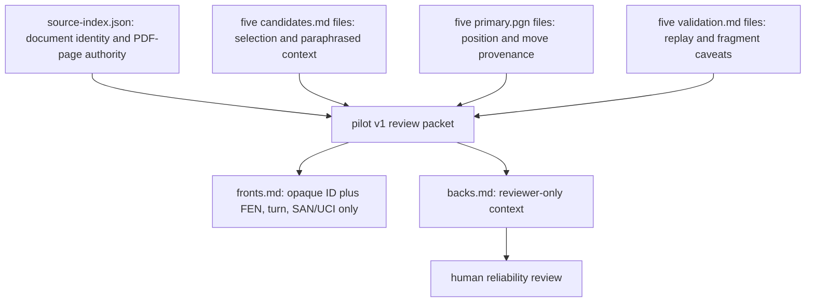

# 포지션 검토 카드 pilot v1

## 목적과 경계

이 패킷은 Chesstories 해설의 체스적 신뢰성을 사람이 검토할 때 쓰는 10장의 개발용 카드뭉치다. 각 카드는 주어진 포지션과 한 수에 대해 설명이 보드와 제한된 책 근거에 부합하는지를 살피게 한다. 이것은 백엔드 구현물, 런타임 입력, schema/DTO, 테스트, fixture, snapshot, golden, 또는 정답 oracle이 아니다.

- 읽기 전용 근거는 `judgment-evaluation/curation/pdf-ideas-v1`의 각 도서별 `candidates.md`, `primary.pgn`, `validation.md`와 `judgment-evaluation/references/source-index.json`뿐이다.
- 웹 자료, 체스 엔진, Tablebase/Syzygy 평가는 사용하지 않았다.
- `source-index.json`의 `document_id`와 1-based PDF page만 책 locator authority로 쓴다. 원본 PDF 경로·이미지·추출문은 재배포하지 않는다.
- 이 current corpus는 **development set**이다. held-out set, test set, 또는 system의 평가 oracle로 전용하면 안 된다.

## front/back 분리

`fronts.md`는 실제 system-facing payload다. 각 카드는 opaque `CARD-###` heading과 다음 세 본문 필드만 가진다: Standard FEN, side to move, reviewed SAN/UCI. source book directory, game/fragment identity, result, branch, document locator, `primary.pgn` record/ply, 그리고 reviewed move 전후의 어느 mainline ply도 front에 넣지 않는다.

시스템에는 한 카드의 heading과 세 본문 필드만 제공한다. `README.md`와 `backs.md`의 source·선택·기보 정보는 reviewer-only이며 system input에 섞지 않는다.

이것은 정적 문서 의존 그래프다. production, runtime, test consumer는 0개다.

## 10장 선택과 다양성

각 도서에서 정확히 두 장을 골랐다. 한 쌍 안에서는 가능한 한 서로 다른 설명 축과 idea horizon을 배치했다.

| Source book directory | Cards | 선택의 대비 | Horizon 대비 |
| --- | --- | --- | --- |
| `ai-revolution` | CARD-001, CARD-002 | 중앙의 재구성과 장기 활동성 / 수비 자원과 패스드 폰 전환 | medium-long / endgame conversion |
| `basman-williams` | CARD-003, CARD-004 | 닫힌 날개와 구조 변화 / 국면 안의 강제적 수순 관계 | long / short |
| `modern-benoni` | CARD-005, CARD-006 | 연결된 약점의 정적 제약 / 준비 뒤의 폰 레버 | medium / short-to-medium |
| `modernized-benko` | CARD-007, CARD-008 | 폰을 되돌리는 분기와 위치 관리 / 장기 물질·기물 전환 | short-to-medium / long |
| `positional-sacrifices` | CARD-009, CARD-010 | 느린 보상과 수비 자원 / 구체적 수순과 반대 자원 | long / short-to-medium |

두 `modernized-benko` 카드는 source가 완전 기보가 아니라 명시된 position-line fragment이므로, 국면의 국소 설명만 다루며 게임 종결·전환의 증거로 쓰지 않는다.

## 실제 사용 절차

1. 한 번에 한 카드의 `fronts.md` heading과 세 본문 필드만 시스템에 제공한다. README, back, source identity, 기보 locator, 이전/이후 mainline은 제공하지 않고 정상적인 자연어 해설을 생성하게 한다.
2. 사람 reviewer는 그 뒤에 해당 `backs.md` 항목을 보며 보드에서 확인 가능한 사실, source의 paraphrase, 대안과 반증 가능성을 함께 점검한다.
3. 여러 체스적 설명이 보드와 근거에 부합하면 허용한다. 책 근거나 보드만으로 뒷받침할 수 없으면 abstention도 유효한 결과다.
4. reviewer는 verdict confidence와 Cause confidence를 독립적으로 기록한다. 하나의 confidence가 다른 하나를 자동으로 결정하지 않는다.
5. 결과를 개발 검토에만 사용한다. 이 카드뭉치를 production prompt, runtime/test consumer, 단일 정답표, 또는 held-out 평가에 연결하지 않는다.

## 파일 범위

이 패킷의 산출물은 다음 네 파일뿐이다.

- `README.md`
- `fronts.md`
- `backs.md`
- `validation.md`
